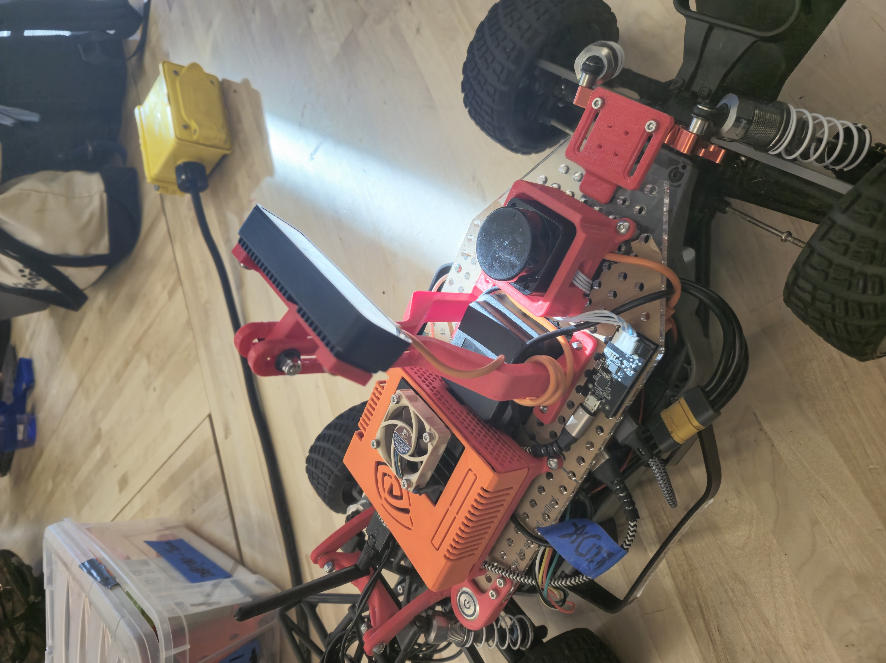

# Object Detection Package

This is a ROS2 package meant for use with a Luxonis OAKD camera, deployed in a docker container on an NVIDIA Jetson, in order to detect and avoid objects.

# Requirements

The code requires the installation of `opencv2`, `depthai`, and other dependencies for the OAKD camera as listed under the [Luxonis documentation](https://docs.luxonis.com/software/depthai/manual-install/) and [Roboflow Docs](https://docs.roboflow.com/deploy/sdks/luxonis-oak)

# Usage

`ros2 run obstacle_detection obstacle_detector`

and in a separate shell

`ros2 run obstacle_detection obstacle_avoider`

The `obstacle_detector` node publishes detected obstacles' (x,y,distance) to the `/object_detection` topic. 

The `obstacle_avoider` node is subscribed to this topic, and publishes the desired steering angle (clamped between 0 and 1) and throttle to `/cmd_vel` and the avoidance state (whether the obstacle avoidance should take control of driving) to `/avoidance_state`.

The steering angle is calculated by grouping obstacles and choosing a VISIBLE path/gap (tolerances defined in a YAML file) that is closest to the center.

The user can preview this through the CLI messages, where `-`  is a gap, `#` is an obstacle, and `^` is the direction for steering, and the steering and throttle values are outputted in the right column.

# TODO

- Further test edge cases (i.e. when entire view is blocked by obstacles)
- Implement a graphic window overlaying steering angle, throttle, and avoidance state